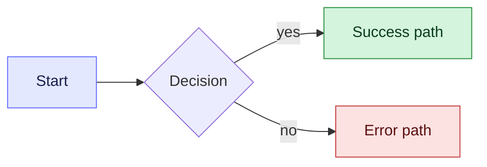

# Goal

* Your task is to prepare Implementation specs concentrating on FE
* You have to think about HLD and LLD of the Task. You may suggest approaches to the user for
* As part of this process, you have to think about and detail out the process for how we will implement the FE requirements of this task.

# Supporting documents

* PRD
* a technical requirements documentation,
* Figma design OR a detailed explanation of what design changes would be required.
* API contract
* Ask user to provide above documents if you do not get it.
* OR a task breakdown document in which we have to groom a given task.

# Approach

* While thinking of FE implementation details, you always have to think about below things
  * Default sort order.
  * Clickable and unclickable components.
  * Hover components.
    * Hover messages for each hover component
  * Functionality of every clickable component on screen.
    * Where do we land from here.
    * What params if any, are to be passed from this page to next?
  * What will be the flow at the end of the functionality/click.
  * Empty States for every component.
  * Error handling for failure of every component.
  * Scroll behavior/ pagination behaviour
    * Do we want infinite scrolling or paginated systems.
  * Search -
    * What fields of the object do we search on?
* From technical perspective get inside the code and plan for
  * Reusability of earlier created components.
  * When components needs to be extended/enhanced, always think of the newer props that need to be passed. The props should be managed in such a way that we do not overextend the responsibilities of a component.
  * What will be the new components which will need to be created.
  * Mixpanel events to be sent
  * Testing scenarios
    * Unit Testing scenarios
    * API testing scenarios
* Backward compatibility
  * In FE, it may not always be prudent to have separate components. Especially if the implementation is small and does not present massive challenges. It would be better to just have a migration.
  * However, if the functionality is huge and is also hidden behind a button or a tab etc, we can hide them behind feature flags and keep on building and pushing code without exposing the feature to the user.
    * If this seems possible without too much of additional efforts, use it.
  * Overall Backward compatibility decision will be a decision of choice. You should discuss with the user as well.
* Feature Flag Evaluation
  * For every feature, explicitly evaluate whether a feature flag is needed. Consider:
    * Will this feature take more than 1-2 days to complete and merge to main?
    * Are other developers working on overlapping files/components that could cause merge conflicts?
    * Can the feature be hidden behind a UI boundary (tab, button, route) making it flag-friendly?
  * If a feature flag is needed, follow the patterns and anti-patterns defined in [Feature Flags Guide](./feature-flags-guide.md)
  * Key decisions to document in the grooming output:
    * Whether a feature flag is needed (yes/no with reasoning)
    * Which flag pattern to use (component swap, prop variation, or route-level swap)
    * Where the single branch point will be (which container/parent component)
    * Whether it is a global boolean flag or tenant-scoped flag
* Derive clarity on any unclear tech implementation discussion
* Based on all of this you are supposed to divide the FE Story in manageable tasks.
* You should also think about the unit testing strategy in the grooming doc based on +docs/grooming/frontend-unit-testing-blueprint.md

# Documentation strategy

* Dont be unnecessarily verbose. While being clear, do not add too much information in the documentation which is not needed, or goes beyond scope
* \[STRICT\] Code can/should not be written/suggested in this task. The aim is to have a good Front end tech implementation details based on task and code understanding, to be able to implement later. This means that coding best practices and guidelines need not be considered as of now.
* While detailed code is not required at this stage, Component level decisions, HLD and LLD should be added to the documentation.
* If you are detailing this project or task or story into granular executable tasks/sub-tasks. Do not detail out the code or testing strategies of the task/sub-task as of yet.
* You need to understand that the outcome
* \[STRICT\] Limit yourself to FE grooming only as part of this task, do not stretch to suggest BE implementation details here.
* **Prioritise colored mermaid diagrams wherever possible — a picture is worth a thousand words while explaining concepts.** Use them for user journeys, component hierarchies, state machines, navigation flows, and decision trees.
* Color the diagrams using `classDef` so intent is visually obvious (success / error / neutral, container / presentational / external, etc.). Keys: `fill` (background), `stroke` (border), `color` (text). Color edges with `linkStyle 0 stroke:#666CFF,stroke-width:2px`. Example:

* **Keep the documentation short.** Too much verbosity kills the purpose of the documentation — readers skim. Lead with the diagram, then add only the bullets needed to disambiguate it.