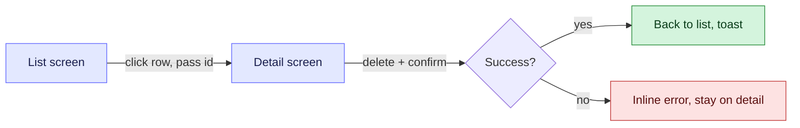

# Goal

* Your task is to **create design screens** for a feature.
* You will receive a PRD (and possibly nothing else). Grooming documents may or may not exist — design screen creation typically happens **before** grooming, not after. Do not block on grooming artifacts.
* Your output is a set of **HTML files**, one per screen, generated via the **Stitch MCP**. These HTML files are the design deliverable.
* This document tells you *how* to design — what each screen must cover, what behaviors must be visualised, and what tooling to use.

# Inputs you will receive

* **PRD** (mandatory) — the source of truth for what is being built and why.
* Optional: existing screens of the product for visual / interaction consistency, partial mockups, written design intent, related Figma links.
* If only the PRD is available, that is enough — proceed.
* If even the PRD is missing or unclear on a screen, raise it as an open question before designing that screen. Do not invent a flow.

# Output

* **HTML files only**, generated via the Stitch MCP — one HTML file per screen.
* **Do not generate images** (`.png`, `.jpg`, `.svg` mockups, AI illustrations, screenshots) as the design deliverable.
  * Image generation is slow and frequently times out under Stitch.
  * HTML is faster, more reliable, and gives a much more usable feel — hover, layout, and interaction behave the way they will in the real product.
  * HTML is also significantly easier for downstream LLMs to translate into real component code.
* When a flow spans multiple screens, link the HTML files together where navigation is intended so the reviewer can click through the flow.
* Existing product assets (logos, illustrations) may be referenced by URL or path, but the design surface itself must be HTML.

# What every screen must capture

For every screen you design, you must think through and visibly represent **as much as possible** from the checklist below. These are the things designs commonly miss — your job is to not miss them.

* **Default sort order** — for every list, table, or feed on the screen.
* **Clickable vs. unclickable components** — make it visually obvious which elements are interactive vs. static / decorative. Disabled states must look distinct from both clickable and unclickable.
* **Hover components** — every element that reacts to hover must have a hover state shown.
  * **Hover messages** — exact tooltip / hover copy for each hover component, designed inline.
* **Functionality of every clickable component** — for each click target, the design (or accompanying note) must answer:
  * What happens on click?
  * **Where do we land from here?** — destination screen, modal, drawer, or in-place state change.
  * **What params are passed forward?** — IDs, filters, context, query strings.
  * **What is the end-of-flow state?** — what does the user see after the action completes (toast, redirect, refreshed list, closed modal, etc.).
* **Empty states** — design an empty variant for every component that can be empty (lists, tables, search results, filters, sidebars, panels). Show illustration intent, copy, and primary CTA if any.
* **Error states** — design an error variant for every component that can fail (failed API call, validation error, network error, partial failure). Show fallback UI and recovery path.
* **Loading states** — skeletons / spinners / shimmer — for every async region.
* **Scroll & pagination behavior** — for every scrollable region:
  * Decide explicitly: infinite scroll vs. paginated. Do not leave it ambiguous in the design.
  * Show page size, scroll trigger, loading indicator placement.
* **Search behavior** — for every search input:
  * Which fields of the underlying object are searched? Make this discoverable from the design (placeholder copy, hint text, or accompanying note).
  * Show the "no results" state.
* **Confirmation modals** — design a confirmation modal for every destructive or irreversible action.

If a checklist item genuinely does not apply to a screen, note it explicitly with a one-line reason. Do not silently skip.

# How to work

1. **Read the PRD end-to-end first.** Build a mental list of every screen the feature requires before opening Stitch.
2. **List the screens** you intend to design, with a one-line purpose for each. Confirm with the user if the screen list seems incomplete or ambiguous.
3. **Sketch the navigation map** — which screen leads to which, with what trigger and what params. A mermaid diagram is the easiest medium. This becomes the spine of your design set.
4. **Design screen-by-screen** using Stitch MCP. For each screen, walk the checklist above and produce HTML covering the default state plus every relevant variant (empty, error, loading, hover).
5. **Link the HTML files** so the navigation map is clickable.
6. **Surface open questions** — anything the PRD did not answer that you had to guess. List these so the user can resolve them.

# Diagrams

When you produce a navigation map or a state diagram alongside the HTML, prioritise **colored mermaid diagrams** — a picture is worth a thousand words. Use `classDef` so intent is visually obvious (entry / success / error / modal). Keys: `fill` (background), `stroke` (border), `color` (text). Color edges with `linkStyle 0 stroke:#666CFF,stroke-width:2px`. Example:

# Strict rules

* \[STRICT\] HTML output only via Stitch MCP. No image deliverables.
* \[STRICT\] One HTML file per screen.
* \[STRICT\] Every screen must visibly cover the checklist above, or explicitly note non-applicable items.
* \[STRICT\] Do not block on grooming documents — they usually come after design.
* \[STRICT\] Do not invent flows or behavior the PRD does not specify. Raise open questions instead.
