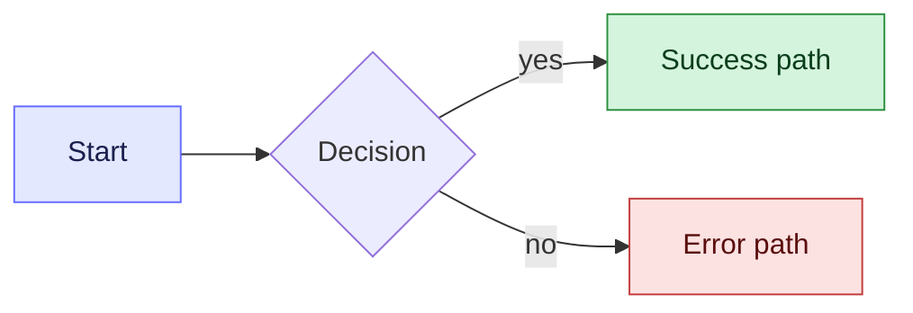

# Goal of the task

* The goal of this task is to understand the development requirements out of  PRD completely and exhaustively.
* The goal is to define what needs to be built and how it should behave.
* Look at things from System behavior, and constraints perspectives
* The finalised requirements need not be a blind following of designs and PRDs. You have the right to question/suggest changes if you foresee constraints, trade-offs and differing design decisions. However, for any such change you have to ask/get confirmation from your user.
* \[STRICT\] You are not to delve into Detailed technical implementation, No timelines, no tasking, no task detailing.

# Supporting documents and approach

* Do consider the immediate user Prompt as the most important part.
* The PRD is written in Coda. Coda documentation link has to be shared with you and access has to be provided. Ask for it if unavailable.
* Given a coda PRD documentation, your task is to understand the requirements properly.
* You also need to go to designs mentioned in the documentation and checkout the related designs for the task. However, designs are not a mandatory pre-requirement of this phase because designs may be simple enough that we can build along with the HLD. 
* Then you need to go to app.nrev.ai and go to the check the current status of the project. If localhost:3000 is running, it will also contain the same app. If a specific link inside localhost or app.nrev.ai is given use that link as the starting point.

# What should be considered and clarified

* If the user Prompt details the requirements in crude way, or have some vagueness to it, get clarifications from the user.
* If you find gaps in the design from the below perspectives, you have to ask relevant questions/ highlight gaps for the same.
  * Missing empty states
  * Missing error scenarios when API/component fails
  * Missing paginations/infinite scrolling for listings
  * Missing default sort orders for listings
  * Missing Hover components and hover messages for hover components, if required.
  * Missing Functionality details of every clickable component on screen.
  * Missing confirmation modal for any destructive actions like delete?
  * Where do we land from these screens.
  * What params if any, are to be passed from this page to next?
  * What will be the flow at the end of the functionality/click.
* Now you should ask me all questions that are not clear by looking at the documentation.
* Also, If there are gaps that depend on the current implementation of some adjacent function or some previous iteration of this feature, then go through those code yourself And don't give me a homework of going through the code and answering questions. Overall, if you can look at the code and the current implementation of adjacent functionality or the first previous iteration of the feature, then you should do that rather than asking questions.  
* Using all of this your task is to understand completely all of the requirements that need to be achieved in this task/PRD.

# Documentation strategy

* Dont be unnecessarily verbose. While being clear, do not add too much information in the documentation which is not needed, or goes beyond scope.
* While writing you have to be extremely clear on the approach and what we are achieving and how. However, the detailed technical understanding of the task can be divided into further sections.
* \[STRICT\] Never assume and never start implementing before full clarity on the requirements. First ask all relevant questions and then only start writing the technical requirements.
* \[STRICT\] No code can/should be created at this step of the process.
* The final goal is to document the requirements understanding from product point of view and fill gaps in requirements and design.
* **Prioritise colored mermaid diagrams wherever possible — a picture is worth a thousand words while explaining concepts.** Use them for user journeys, decision trees, and end-to-end flows so requirements are unambiguous before any technical work begins.
* Color the diagrams using `classDef` so intent is visually obvious (in-scope / out-of-scope / open question, happy path / edge case, etc.). Keys: `fill` (background), `stroke` (border), `color` (text). Color edges with `linkStyle 0 stroke:#666CFF,stroke-width:2px`. Example:

* **Keep the documentation short.** Too much verbosity kills the purpose of the documentation — readers skim. Lead with the diagram, then add only the bullets needed to disambiguate it.

# Required structure of the requirements document

Every grooming requirements document must follow this section order. Section names are fixed — do not rename or reorder.

1. **TL;DR** — One short paragraph: what is being built, for whom, and why now. A reader should understand the change from this section alone.
2. **Problem** — The user/business problem and the gap in the current state. Reference the current surfaces, flows, or behavior being addressed. Use a comparison table when contrasting "today" vs "with this change" helps.
3. **Goals** — Numbered list of outcomes this work must achieve. Each goal is a measurable or observable outcome, not a feature description.
4. **Out of Scope (v1)** — Explicitly list what is *not* being built in this iteration, even if it is adjacent or anticipated. Be concrete; "scheduling is deferred" is better than "advanced features are deferred". This section prevents scope creep during build.
5. **Users & personas** — Who interacts with this feature and how their needs differ. Keep it tight — 2–4 personas with one line each on what they want.
6. **Use cases** — Concrete "User says/does X → system does Y" examples that cover the primary flows. A table works well here. Use cases must be representative of the goals, not exhaustive of every clickable path.
7. **Requirements** — Split into **Functional** (system behavior, multi-turn flows, scoping rules, fallbacks, persona consistency) and **Non-functional** (latency, caps, limits, security, backwards compatibility, accessibility). Cover the gap-finding checklist from the section above (empty states, error states, pagination, default sort, hover behavior, confirmation modals for destructive actions, landing destinations, params passed forward, end-of-flow state).

\[STRICT\] **No solution / implementation / architecture section.** Implementation documentation is not the purpose of the grooming phase. Feasibility commentary is allowed inline within Requirements when it is needed to validate that a requirement is achievable — not to describe how it will be built. Detailed design, file layout, API shapes, data models, and code structure belong in the HLD/LLD that follows grooming, not here.

\[STRICT\] If the PRD or designs are missing any of the above sections' worth of information, raise the gap as a clarification question before writing the document. Do not invent content to fill a section.