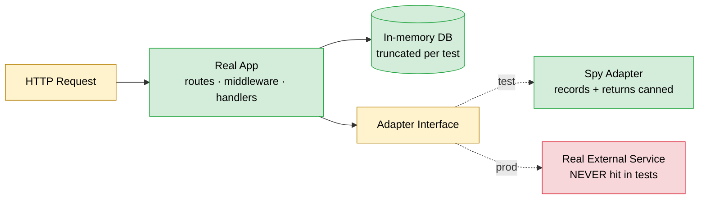
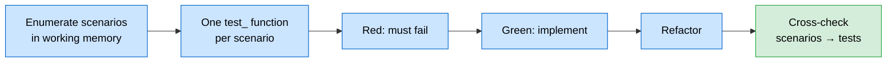

# Backend API Testing Blueprint (Agent Edition)

> Tests at the HTTP boundary. Stack: **Python + pytest + httpx / FastAPI TestClient**. BDD principles, not BDD tooling.

---

## 1. Scope



API tests verify routing, validation, auth, persistence, serialization, contracts.

**Goals (priority order):** reduce fear of change → capture regressions → document the API → catch integration bugs → verify multi-step workflows.

**NOT for:** logic inside a pure function (unit), load/perf (separate tooling), UI (E2E), exhaustive validator branches (unit on the validator).

---

## 2. BDD Principles, Plain pytest

| BDD principle | How it applies |
|---|---|
| User-observable behaviour | Test names describe what the *caller* achieves |
| Scenarios enumerated before code | Agent reasons through full scenario set in working memory before writing the first `test_` |
| Declarative, not imperative | Body reads "Given X, when I call API, expect Y" |
| QA mindset for edges | Enumerate failure modes, auth/scope, idempotency, concurrency, multi-use cases |
| One dataset, many assertions | Fixtures + parametrization |
| Real app surface | Hit the FastAPI app via `TestClient` / `httpx.AsyncClient` — no handler mocking |

**No** `.feature` files, Gherkin, step registries, separate QA/dev paths, or product-facing DSL.

---

## 3. The Process



For every endpoint enumerate:

- Happy path(s) — including each distinct use case if one endpoint serves many.
- Validation failures (1 happy + 1 failing per validator; exhaustive cases live in unit tests).
- Auth (401) and scope (403).
- Idempotency / concurrency (when claimed).
- Persistent side effects (read-back via another API call).

Example shape:

```
POST /invoices
- creates an invoice for a valid customer with line items → 201
- rejects a missing customer_id → 400
- rejects line items with negative quantity → 400
- requires authentication → 401
- requires the "billing:write" scope → 403
- is idempotent on the idempotency-key header
- persists created_at in UTC
```

**Bug fix:** reproduce as failing API test → fix → keep as regression.
**Modify endpoint:** if untested, write scenarios for current behaviour first. Update tests only when the contract genuinely changed; refactor-induced breakage means the test was wrong.
**Multi-use endpoint:** every use case is a distinct scenario set — don't piggy-back.

---

## 4. Conventions

**Naming — behaviour-shaped.**

```python
# GOOD
class TestCreateInvoice:
    def test_creates_invoice_for_valid_customer_with_line_items(self, client): ...
    def test_returns_cached_response_when_idempotency_key_repeats(self, client): ...
    def test_requires_billing_write_scope(self, client): ...

# BAD
def test_post(self, client): ...
def test_post_400(self, client): ...
```

**Body — Given/When/Then via blank lines. Declarative.**

```python
def test_creates_invoice_for_valid_customer_with_line_items(client, billing_token):
    customer = fixtures.create_customer(tier="gold")
    payload = {"customer_id": customer.id, "line_items": [{"sku": "S-1", "quantity": 2, "unit_price": "50.00"}]}

    response = client.post("/invoices", json=payload, headers=auth(billing_token))

    assert response.status_code == 201
    body = response.json()
    assert body["customer_id"] == customer.id
    assert body["total"] == "100.00"
```

**Reuse fixtures** for shared setup. **Parametrize** validation families with the same shape — but split tests with different *intent*.

```python
@pytest.mark.parametrize("bad_payload,field,error", [
    ({"customer_id": None}, "customer_id", "required"),
    ({"line_items": []}, "line_items", "min_length"),
    ({"line_items": [{"quantity": -1}]}, "line_items.0.quantity", "positive"),
])
def test_rejects_invalid_payload(client, billing_token, bad_payload, field, error):
    response = client.post("/invoices", json=bad_payload, headers=auth(billing_token))
    assert response.status_code == 400
    assert_field_error(response, field, error)
```

---

## 5. Project Structure

```
tests/api/
  conftest.py              # app, client, db, auth, spy fixtures
  fixtures/                # factory helpers
  invoices/
    test_create_invoice.py
    test_publish_invoice.py
  auth/
    test_login.py
```

Mirror the resource hierarchy. Every test starts on a clean DB (autouse truncation fixture).

Core fixtures: `app` (test config + in-memory DB), `client` (`TestClient(app)`), `db`, auth tokens (`billing_token`, `admin_token`), spies (§6).

---

## 6. External Dependencies — Spy Pattern

```python
class SpyEmailAdapter:
    def __init__(self):
        self.sent: list[SentEmail] = []

    def send(self, to, subject, body):
        self.sent.append(SentEmail(to, subject, body))
        return f"msg-{len(self.sent)}"

    def sent_to(self, address, subject_contains=None):
        return any(m.to == address and (subject_contains is None or subject_contains in m.subject) for m in self.sent)
```

- **Spy over mock.** Real class, real signatures; records and returns.
- **Assert at the boundary** — "did we send an email to this customer?", not "was `EmailClient.send` called with X, Y, Z".
- **Reset per test.**
- **DB:** in-memory or containerised Postgres, truncated per test. Never a shared dev DB.
- **Time/randomness:** freeze with a fixture only when assertions depend on values; otherwise assert shape.

---

## 7. What to Assert

| ✓ Assert | ✗ Don't assert |
|---|---|
| HTTP status, body, contract headers (`Location`, `ETag`) | Which handler/method ran |
| Persistent effects via read-back | Internal service state, SQL strings |
| Outbound effects via spies | Call counts on internal helpers |
| Error codes + field paths | Log lines (unless logs ARE the contract) |

**Round-trip writes:** verify by `GET` after `POST` — keeps the test honest about the public contract.

```python
def test_created_invoice_is_retrievable(client, billing_token):
    created = client.post("/invoices", json=valid_payload, headers=auth(billing_token)).json()
    fetched = client.get(f"/invoices/{created['id']}", headers=auth(billing_token)).json()
    assert fetched == created
```

---

## 8. Running

```
pytest tests/api                 # full
pytest tests/api/invoices        # one resource
pytest tests/api -k "idempotency"  # filter
pytest tests/api -n auto         # parallel
pytest tests/api --cov=src       # coverage
```

| Phase | What to run |
|---|---|
| Iterating | scoped `pytest tests/api/<resource>` |
| Before declaring done | full `tests/api` + `tests/unit` |
| CI | full + coverage + parallel |

Coverage on handlers/serializers should be near 100% (real requests exercise them). Models/helpers/validators get coverage from unit tests, not API tests. Coverage here is a **scenario-completeness proxy** — walk the enumerated list against the tests before concluding work.

---

## 9. What NOT to Do

1. Mock internal collaborators — use the real stack with in-memory DB.
2. Assert on internal calls — contract only.
3. Hit external services — spies always.
4. Share state between tests — reset DB + spies.
5. Duplicate validator unit tests — one happy + one failing wires it up.
6. Skip the enumeration phase.
7. Treat "endpoint serves N use cases" as one scenario set.
8. Assert on logs/metrics unless they're a documented contract.
9. Rely on test order.

---

## 10. Pre-Completion Checklist

- [ ] Every enumerated scenario maps to a `test_` function with a behaviour-shaped name.
- [ ] Real app stack — no handler-level mocking.
- [ ] External calls go through spies; no network leaves the process.
- [ ] DB resets per test.
- [ ] Validation edge cases covered (happy path + key failure paths per validator — exhaustive cases live in unit tests).
- [ ] Auth/scope covered for every non-public endpoint.
- [ ] Idempotency/concurrency covered where claimed.
- [ ] Multi-use endpoints have distinct scenarios per use case.
- [ ] Bug fixes include a regression scenario that failed before the fix.
- [ ] `pytest tests/api` passes in full.

---

## 11. Pending Approval — Not Yet Adopted

Behave / Cucumber / `.feature` files; Pact / contract testing; OpenAPI/JSON-schema assertion every test; snapshot bodies; VCR.py replay; TestContainers as default DB; Locust/k6; Hypothesis/Schemathesis; mutation testing; QA-authored DSL. To adopt any: explicit sign-off.
