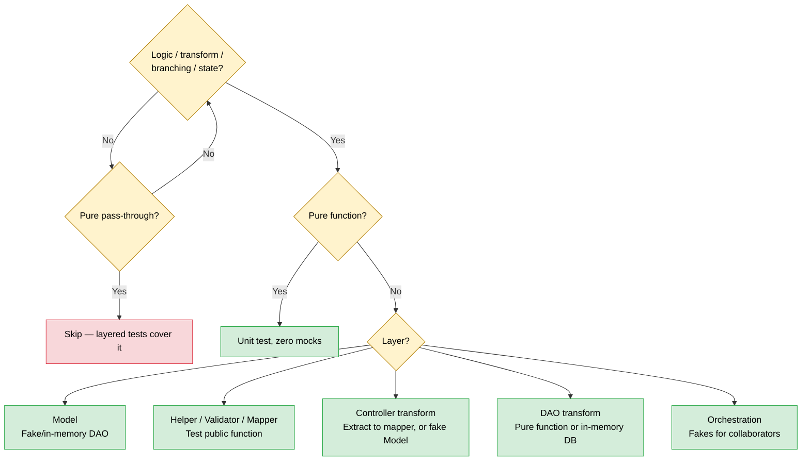
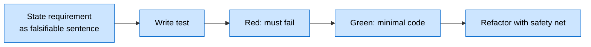
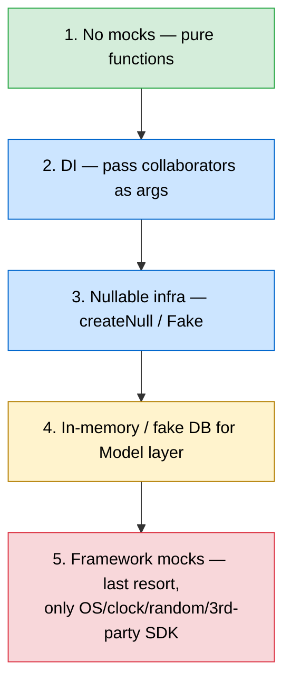
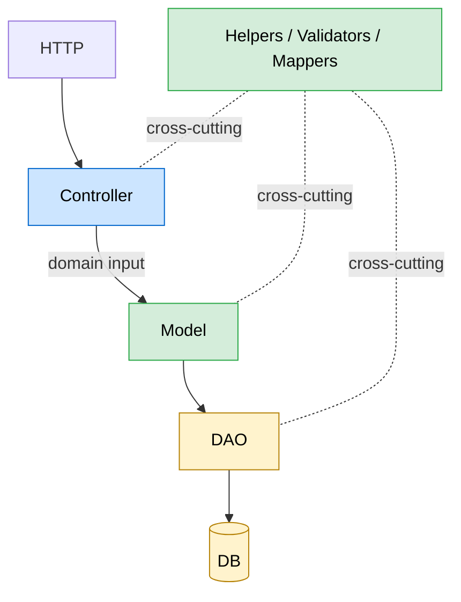

# Backend Unit Testing Blueprint (Agent Edition)

> Stack: **Python + pytest**. Principles port to any backend language.

---

## 1. Goals

Unit tests, in priority order:

1. **Pinpoint debugging** — a failing test points at the line.
2. **Design pressure** — hard-to-test code is wrong code.
3. **Refactor safety net.**
4. **Catch edge cases the author missed.**
5. **Surface unanswered specs** (TDD as discovery).

**NOT for:** chasing coverage, multi-module workflows (API/integration territory), behavioural bugs from wrong assumptions.

---

## 2. What's a "Unit"?

A **behaviour**, not a class method.

> "I need to add amounts in two currencies given exchange rates" → behaviour
> "I need a `convertCurrency` method on `Money`" → implementation detail

The first is TDD; the test is the first consumer. Start from caller intent, not class names.

---

## 3. What to Test

> **AI-era recalibration.** "Don't test" rules used to mean "not worth a human's minutes". Agents write tests in seconds — the bar is now **brittleness, noise, or duplication**, never effort.



**MUST test:**
- Helpers / validators / mappers / serializers (public functions).
- Model layer — domain logic, state transitions, invariants.
- Pure functions (zero collaborators, highest ROI).
- Adapter contracts.
- Controller transforms — request→domain mapping, response shaping, conditional routing, header/cookie parsing.
- DAO transforms — row↔domain, query filter composition, JSON/JSONB parsing, pagination math, cursor encoding, bulk chunking.
- Orchestration with branching, retry policy, fan-out/fan-in.

**DON'T test:**
- Pure pass-through controllers (parse → call → return).
- Pure pass-through DAO methods (single SQL, no transform).
- Zero-logic DTOs / constants / `__init__` / barrel exports.
- Private functions by default (brittleness — see §5.4).
- The channel itself (Kafka/RMQ/asyncio.Queue) — test publisher's output and receiver's input separately.
- Real DBs in unit tests (cross-test contamination + speed).

---

## 4. TDD Loop



- **Bug fix:** reproduce as failing test → fix → keep forever as regression.
- **Modify untested code:** write tests for existing behaviour first, then change.
- **Never leave a broken test.** "Too long" is not a reason — generation cost is near zero.

---

## 5. Core Rules

**5.1 Behaviour, not implementation.** Same signature → tests don't change. A refactor that breaks tests means the test was coupled wrong.

**5.2 Pure functions are the north star.** No side effects. **Never mutate parameters.** If a test inspects a passed-in DS post-call to verify behaviour, the function is impure — refactor.

**5.3 Don't pass HTTP req/res below the Controller.** Controller parses to a domain input → Model receives the domain input. Coupling Model signatures to HTTP shape cascades every middleware change into every model test.

**5.4 Don't test private functions by default.** Brittleness, not effort, is the reason. **Preferred escape:** refactor private logic into a public helper. **Acceptable fallback:** test the private one when extraction is disproportionate; mark as debugging aid; reach the same behaviour via a public-API test elsewhere.

**5.5 Test isolation.** The unit of isolation is the test, not the system under test. Tests run in any order, in parallel, no cross-talk.

**5.6 Loose coupling.** Test publisher's output and receiver's input separately. Don't test the transport.

---

## 6. Mocking Policy



> **Heuristic: >3 mocks per file → refactor.** Extract pure logic; accept deps as constructor params; introduce a port + adapter.

**Dependency ownership.** Objects construct their own deps by default; tests override at construction (`PricingModel(dao=FakePricingDao())`). Do NOT thread deps through every function signature.

---

## 7. Layer-by-Layer



**Helpers / Validators / Mappers.** Every public function. Pure. Zero mocks. Highest ROI.

**Controller.** Pass-through (parse → call → return) → no unit test. Transforming (mapping, shaping, header parsing, conditional routing, multi-model composition) → test. Prefer extracting the transform into a mapper module (pure-function test); else test in place with a fake Model. Every Model call from a controller should have a corresponding Model unit test somewhere in the suite.

**Model.** Centerpiece. Talks to ideally one DAO. Inject a fake DAO or in-memory DB. Cover every state transition, branch, and error path.

```python
class PricingModel:
    def __init__(self, dao: PricingDao = None):
        self.dao = dao or PricingDao()

def test_calculate_invoice_applies_loyalty_tier():
    model = PricingModel(dao=FakePricingDao(customer_tier={"c1": "gold"}))
    invoice = model.calculate_invoice("c1")
    assert invoice.discount_applied == Decimal("15")
```

**DAO.** Pass-through SQL → no unit test. **Transforms — test:** row→domain (denormalised JOINs, null/JSONB), domain→insert (audit fields, defaults, timezone), query filter composition, pagination/cursor encoding, bulk chunking. Pull transforms into a pure function (`dao/transforms.py`) where you can. Fallback: in-memory DB. Never assert on the literal SQL string — assert on result shape or rows read back.

**Infrastructure wrappers.** Wrap third-party SDKs in a thin adapter so tests can swap with `createNull()`. Strongly recommended for payment, auth, search, queue, cache, LLM provider.

**A-Frame architecture (James Shore).** Application wires Logic + Infrastructure. Application plumbing doesn't need unit tests. Logic is pure, heavily tested. Infrastructure tested via nullable factories.

---

## 8. Test Conventions

**Layout.** Mirror `src/` under `tests/`. Colocate helpers next to tests.

```
src/pricing/{helpers,model,dao}.py
tests/pricing/{test_helpers,test_model,conftest,builders}.py
```

**Naming — behaviour-first.**

```python
# GOOD
class TestCurrencyConversion:
    def test_converts_usd_to_eur_at_given_rate(self): ...
    def test_raises_when_rate_is_missing(self): ...

# BAD
class TestConvertFunction:
    def test_convert_returns_float(self): ...
    def test_convert_calls_rate_lookup(self): ...
```

**AAA structure.**

```python
def test_converts_usd_to_eur_at_given_rate():
    # Arrange
    amount = Money(Decimal("100"), "USD")
    rate = ExchangeRate("USD", "EUR", Decimal("0.85"))
    # Act
    result = convert(amount, rate)
    # Assert
    assert result == Money(Decimal("85"), "EUR")
```

**Edge cases per unit:** happy, empty/null, boundary, invalid types, cardinality (0/1/N), error conditions.

**Fixture builders.** Function with defaults + overrides. 1 file → inline. 1 package → `tests/<package>/builders.py`. Cross-package → `tests/builders/`.

**Parametrize** for same-shape behaviour. Don't hide diverging assertions behind one parametrized test — split.

---

## 9. pytest Configuration

```toml
[tool.pytest.ini_options]
testpaths = ["tests"]
addopts = ["-ra", "--strict-markers", "--strict-config"]

[tool.coverage.run]
source = ["src"]
omit = ["*/__init__.py", "*/types.py", "*/constants.py", "*/dto/*", "*/migrations/*"]

[tool.coverage.report]
fail_under = 75
```

| Phase | Command |
|---|---|
| Iterating on a unit | `pytest tests/<package>` |
| Before declaring done | `pytest --cov` (full) |
| CI | `pytest --cov` with `fail_under=75` |

A scoped pass is a checkpoint, not a completion gate.

---

## 10. What NOT to Do

1. Chase coverage numbers — empty-assertion tests are noise.
2. Test pure pass-through controllers — but DO test transforming/routing controllers.
3. Mock everything — >3 mocks → refactor.
4. Test implementation details (method names, call counts, private attrs).
5. Test thin wrappers (no transform, no branching).
6. Default to private-function tests — refactor first.
7. Test the channel — only the publisher's output and receiver's input.
8. Mutate args + assert on them — fix the design.
9. Pass HTTP req/res below the Controller.
10. Hit a real DB.
11. Share state between tests.
12. Confuse "cheap to write" with "worth writing".

---

## 11. Pre-Completion Checklist

- [ ] Enumerated units with testable behaviour (controller transforms, DAO transforms, orchestration branches included).
- [ ] Pure functions tested with zero mocks.
- [ ] Model methods tested with fake/in-memory DAO.
- [ ] Controller transforms tested (extracted to mapper where practical).
- [ ] DAO transforms tested (pure function or in-memory DB).
- [ ] Pass-through controllers and DAOs NOT tested.
- [ ] Tests describe behaviour, not implementation.
- [ ] Edge cases covered.
- [ ] ≤3 mocks per file.
- [ ] No default private-function tests.
- [ ] No HTTP req/res below Controller.
- [ ] No mutation of passed-in args.
- [ ] Every test pins a behaviour a future reader would care about — no noise tests, no coverage-padding.
- [ ] Full `pytest` passes; coverage threshold holds.
- [ ] Bug fixes include a regression test that failed first.

---

## 12. Pending Approval — Not Yet Adopted

Property-based testing (Hypothesis); mutation testing (`mutmut`/`cosmic-ray`); snapshot/golden-file; TestContainers/real-Postgres in unit tests; default `unittest.mock.patch` on internal collaborators; routine private-function testing; 100% coverage mandate; Given-When-Then naming inside unit tests; shared test DB with rollback. To adopt any: explicit sign-off.
