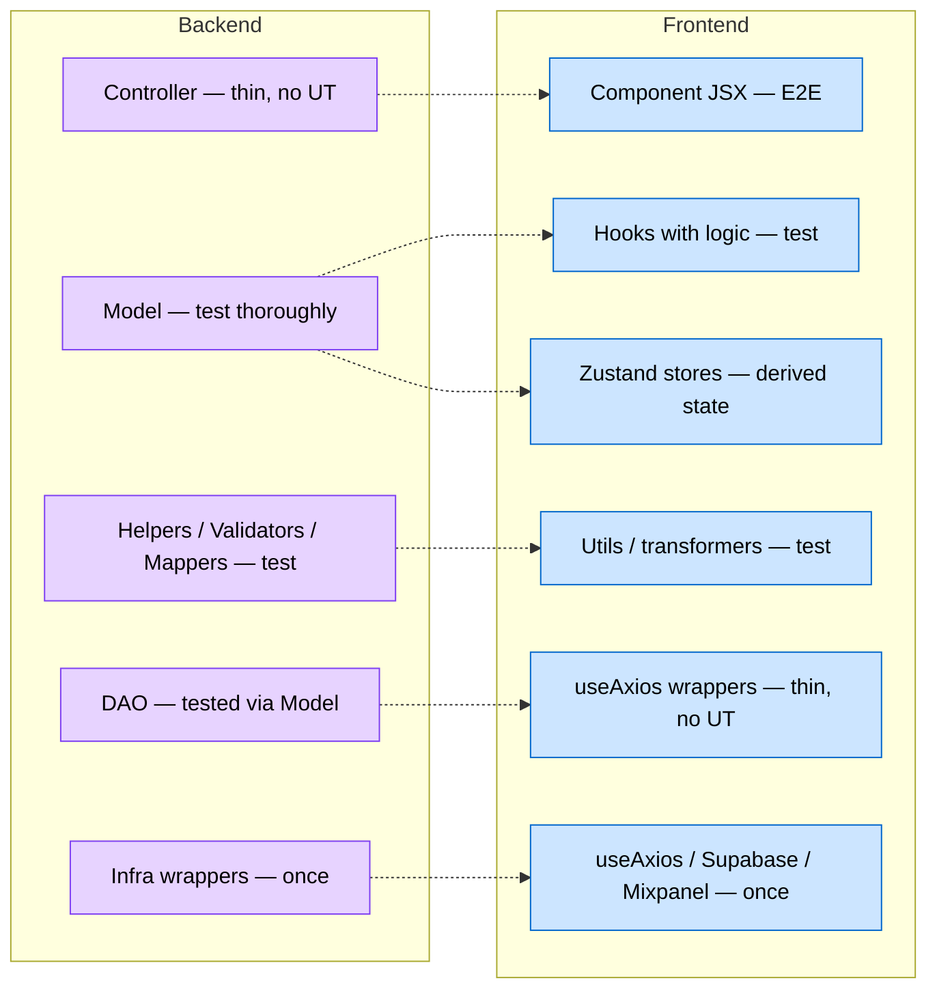
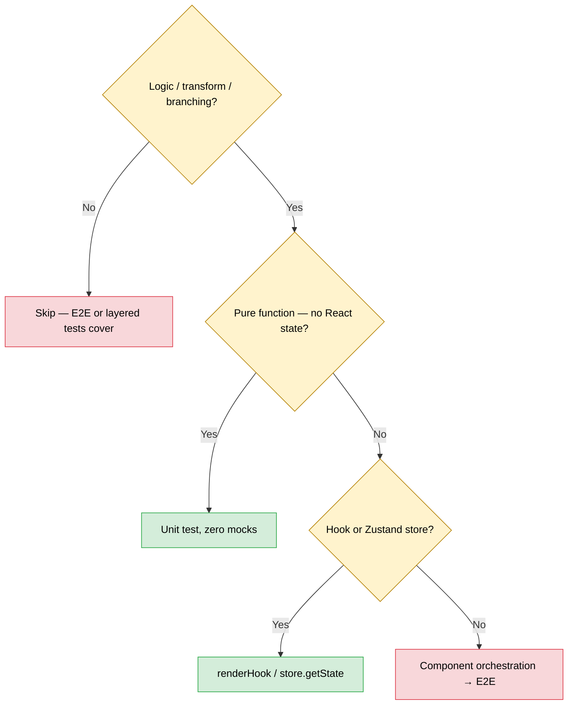
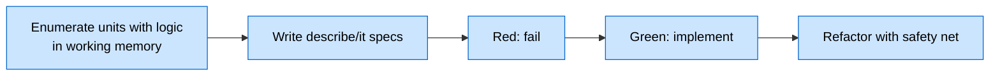
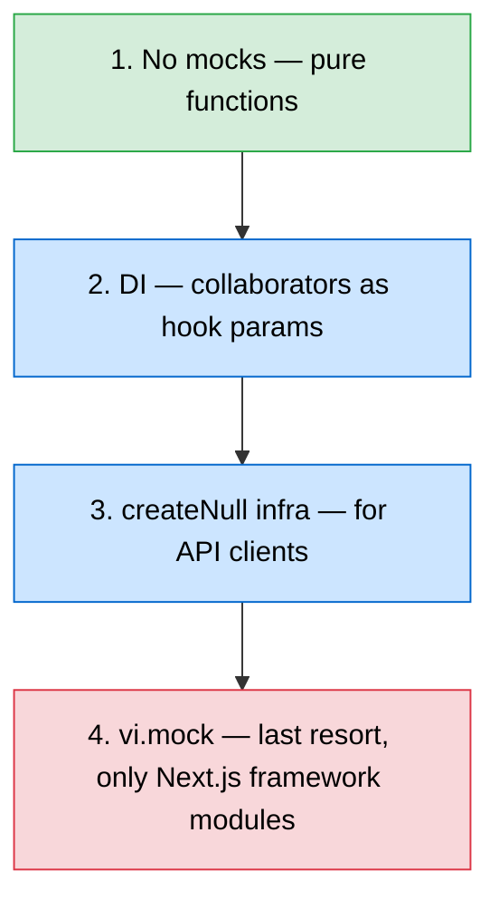

# Frontend Unit Testing Blueprint (Agent Edition)

> Stack: **Vitest** + **@testing-library/react** (already configured).

---

## 1. Backend → Frontend Mapping



Context providers = ports; concrete implementations = adapters.

---

## 2. What to Test



**MUST test:** pure utils/helpers/validators/mappers/transformers; custom hooks with logic (state machines, computed values, orchestration); Zustand stores with derived state or logic-bearing actions; routing / backward-compat / adapter layers.

**DON'T test:** component JSX (Playwright); thin `useAxios` wrappers without transform; types/constants; pass-through context providers; barrel exports.

---

## 3. TDD Loop



- **Bug fix:** failing test first → fix → keep as regression.
- **Modify untested code:** write tests for existing behaviour first, then change.
- **Never touch code without thinking about tests.**

---

## 4. Conventions

**Location.** Colocated under `__tests__/`:

```
feature/{hooks,utils}.ts
feature/__tests__/{hooks,utils}.test.ts
```

**Naming — behaviour-first.**

```typescript
// GOOD
describe("agentRouting", () => {
  describe("when agent is NODE_CONFIG_GENERATOR", () => {
    it("routes to /ai/conversation/start", () => { ... })
  })
})

// BAD
describe("isNewApiAgent", () => {
  it("returns true for NODE_CONFIG_GENERATOR", () => { ... })
})
```

**Structure — Arrange / Act / Assert.**

```typescript
it("converts USD to EUR at given rate", () => {
  const input = { currency: "USD", amount: 100 }
  const actual = convertCurrency(input, { targetCurrency: "EUR", rate: 0.85 })
  expect(actual).toEqual({ currency: "EUR", amount: 85 })
})
```

**Edge cases per unit:** happy, null/undefined/empty, boundary, invalid types, 0/1/N items, error conditions.

---

## 5. Mocking Policy



> **>3 mocks → refactor.** Extract pure utils, accept deps as params, use Ports & Adapters.

```typescript
// TIER 1 — pure
it("creates label from field type", () => {
  expect(createLabelFromFieldType("multi_select")).toBe("Multi select")
})

// TIER 2 — DI via hook params
it("calls onApplyAIValues with settings", () => {
  const onApply = vi.fn()
  const { result } = renderHook(() => useNodeConfigSync({ onApplyAIValues: onApply }))
  result.current.applyAIChanges([{ field_name: "to", field_value: "x" }])
  expect(onApply).toHaveBeenCalledWith([{ field_name: "to", field_value: "x" }])
})
```

---

## 6. Fixture Builders

```typescript
const createMockNodeConfig = (overrides?: Partial<WorkflowBlockDto>): WorkflowBlockDto => ({
  id: "node-1",
  typeId: "filter-emails",
  variableName: "Filter Emails",
  ...overrides,
})
```

| Scope | Location |
|---|---|
| 1 test file | Inline |
| 2+ files in same feature | `feature/__tests__/builders.ts` |
| Multiple features | `tests/unit/builders/` |

---

## 7. Per-Layer Examples

**Pure utility.**

```typescript
describe("inputTypeNormalizer", () => {
  it("skips string type fields", () => {
    expect(shouldAddInputTypes(buildField({ type: "string" }), mockNodeDef)).toBe(false)
  })
  it("allows select type fields", () => {
    expect(shouldAddInputTypes(buildField({ type: "select" }), mockNodeDef)).toBe(true)
  })
})
```

**Custom hook.**

```typescript
it("returns validation errors for empty required fields", () => {
  const { result } = renderHook(() =>
    useFormValidation({ fields: mockFields, values: {} })
  )
  expect(result.current.errors).toContainEqual({ field: "email", message: "Required" })
})
```

**Zustand store.**

```typescript
beforeEach(() => {
  useInterfaceFormStore.setState(useInterfaceFormStore.getInitialState())
})

it("sets form values without overwriting unrelated fields", () => {
  const { setFieldValue } = useInterfaceFormStore.getState()
  setFieldValue("email", "test@example.com")
  setFieldValue("name", "John")
  expect(useInterfaceFormStore.getState().formValues).toEqual({
    email: "test@example.com",
    name: "John",
  })
})
```

---

## 8. Vitest Config

```typescript
coverage: {
  provider: "v8",
  reporter: ["text", "html", "lcov"],
  include: [
    "components/**/{utils,hooks}/**/*.ts",
    "components/**/hooks.ts",
    "app/**/{helpers,utils,hooks,store}/**/*.ts",
    "app/**/hooks.ts",
    "{hooks,utils,lib}/**/*.ts",
  ],
  exclude: [
    "**/*.test.{ts,tsx}", "**/{types,constants,index}.ts",
    "**/*ApiService.ts", "**/dtos/**",
  ],
  thresholds: { statements: 75, branches: 70, functions: 75, lines: 75 },
}
```

```json
{
  "test:unit": "vitest run",
  "test:unit:watch": "vitest",
  "test:unit:ci": "vitest run --coverage --reporter=dot",
  "test:unit:changed": "vitest run --changed"
}
```

| Phase | Command |
|---|---|
| Iterating | `test:unit:changed` or `vitest run <path>` |
| Before declaring done | `test:unit` (full) |
| CI | `test:unit:ci` |

`test:unit:watch` is a human inner-loop tool — agents skip it.

---

## 9. What NOT to Do

1. Chase coverage — 80% is a guardrail, not a goal.
2. Test component rendering — Playwright covers it.
3. Mock everything — >3 mocks = refactor signal.
4. Test implementation details.
5. Test thin `*ApiService.ts` wrappers.
6. Write tests when nothing meaningful to assert.
7. Test private/internal functions — refactor to public helpers if they need testing.
8. Test the channel — A→B→C glue is integration territory.

---

## 10. Pre-Completion Checklist

- [ ] Enumerated which units contain testable business logic.
- [ ] Pure utils have unit tests (zero mocks).
- [ ] Hooks with state/transform logic tested via `renderHook`.
- [ ] Zustand actions with logic tested directly.
- [ ] Tests describe behaviour, not implementation.
- [ ] Edge cases covered.
- [ ] ≤3 mocks per file.
- [ ] Test files in `__tests__/`.
- [ ] Full `vitest run` passes.
- [ ] Bug fixes include a regression test that failed first.
