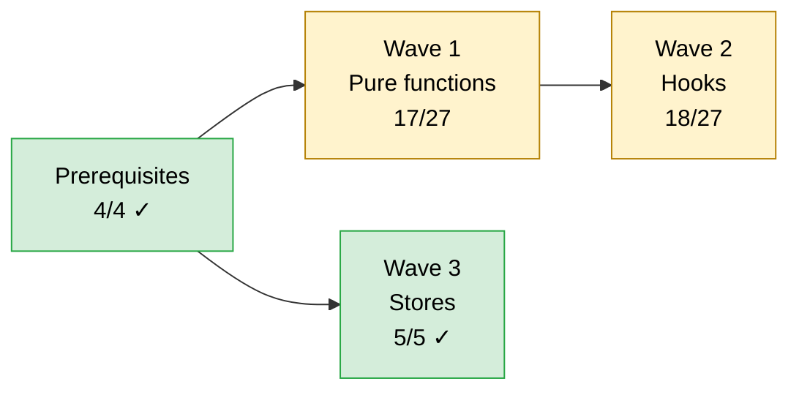
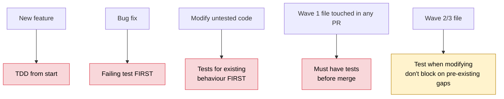

# Frontend Unit Testing Roadmap

> Inventory + wave plan. HOW to test → see `frontend-unit-testing-blueprint.md`.
> Last updated: Feb 17, 2026

---

## Wave Status

| Wave | Status | Done | Remaining |
|---|---|---|---|
| Prerequisites | ✓ | 4 | 0 |
| Wave 1 — Pure functions | In progress | 17 | 10 |
| Wave 2 — Hooks | In progress | 18 | 9 |
| Wave 3 — Stores | ✓ | 5 | 0 |

**Total ~59 new test files when waves complete.**

---

## Coverage Audit (67 test files today)

| Area | Status |
|---|---|
| `dynamic_forms/utils/` — `fieldRetentionUtils`, `reloadPropsUtils` | ✓ |
| `dynamic_forms/hooks/` — `useReloadProps`, `useConditionalValueCleaner` | ✓ |
| `dynamic_forms/` integration — `Container.formReinitialize`, `RecursiveContainer.reloadProps`, etc. | ✓ |
| `ai-builder/` integration — `ActionRegistry`, `backward-compatibility`, `chat-panel-thread-flow`, etc. | ✓ |
| `ai-builder/hooks + utils` — `agentRouting`, `useWorkflowActions`, `useChatMessages`, etc. | ✓ |
| `node-config-ai/` — `hooks.ts` (4 hooks), `useAIInputTypeManager` | ✓ |
| `workflows/interactions + interface` — `useWorkflowContextMenu`, `useExecutionThread`, `useFormValidation`, etc. | ✓ |
| Global hooks — `useAxios`, `useAutoClose`, `useGlobalNavigation`, `usePageTimeTracking` | ✓ |
| Stores — `InterfaceFormStore`, `TenantStore`, `AuthStore`, `loadingUiStore`, `FilePreviewStore` | ✓ |
| Shared utils — `inputTypeUtils`, `formUtils`, `referenceTransform`, `lib/utils`, `feature-flags`, etc. | ✓ |

**Deprecated / skipped:** `reloadProps` is being deprecated — `reloadPropsUtils.test.ts`, `Container.reloadProps.integration.test.ts`.

---

## Gaps

| Area | Untested | Priority |
|---|---|---|
| `dynamic_forms/hooks/` | `useSettingFieldDataSource` (708), `useFormInitialization` (346), `useReloadPropsManager`, `useInputTypeManager`, `useDynamicInputOptions`, `useFieldValidation`, `useMention`, `useServerErrorHandling` | CRITICAL |
| `workflow helpers/` | `WorkflowUtils`, `WorkflowBlockUtils`, `WorkflowConditionUtils`, `WorkflowLayoutUtils`, `ColumnMetadataUtils`, `ExecutionWorkflowUtils`, `NodeInputMetadataExtractor` | HIGH |
| `workflow hooks/` | `useNodeConfigAI`, `useDynamicFormStateManager` (214) | HIGH |
| `workflow utils/` | `workflowBuilderUtils`, `aiChatUtils`, `nodeFormSaver`, `defaultValueApplier` | MEDIUM |
| `workflow-interface/hooks/` | `useInterfaceConversation` polling edge cases, `useNodeDefinition` error branches | MEDIUM |
| `node-config-ai/hooks/` | `useAIFieldOptions` (275) | MEDIUM |

---

## Wave 1 — Pure Functions (zero mocks, highest ROI)

| # | File | ~Lines | Behaviours |
|---|---|---|---|
| 1 | `dynamic_forms/utils/inputTypeNormalizer.ts` | 162 | Type normalization, SKIPPED_TYPES filter, validator dispatch, `createLabelFromFieldType` |
| 2 | `dynamic_forms/hooks/inputTypeUtils.ts` | 100 | `hasMultipleInputTypes`, `getCurrentFieldConfig`, position helpers |
| 3 | `dynamic_forms/utils/formUtils.ts` | 34 | Form value extraction, normalization |
| 4 | `dynamic_forms/utils/columnIntersection.ts` | 33 | Column matching |
| 5 | `dynamic_forms/utils/referenceTransform.ts` | 67 | Reference data transformation |
| 6 | `dynamic_forms/utils/blockNameUtils.ts` | 48 | Block name generation/validation |
| 7 | `dynamic_forms/utils/navigationUtils.ts` | 43 | Navigation path computation |
| 8 | `dynamic_forms/utils/dynamic-options.ts` | 36 | Dynamic option resolution |
| 9 | `dynamic_forms/utils/fileReaderUtils.ts` | 46 | File reading |
| 10 | `dynamic_forms/form-management/utils/formErrorUtils.ts` | 50 | Error formatting |
| 11 | `ai-builder/utils/agentRouting.ts` | 184 | URL routing by agent, param building |
| 12-18 | `app/workflows/.../helpers/{Workflow,WorkflowBlock,WorkflowCondition,ColumnMetadata,NodeInputMetadataExtractor,WorkflowLayout,ExecutionWorkflow}Utils.ts` | 100-200 each | Workflow state / block / condition / layout / execution helpers |
| 19-22 | `app/workflows/.../utils/{workflowBuilder,defaultValueApplier,nodeFormSaver,RunTimePreference}Utils.ts` | 13-96 | Builder state, defaults, save prep |
| 23-25 | `utils/{workflow-utils,youtube-utils,feature-flags}.ts` | 22-116 | Layout, YouTube parsing, flag eval |
| 26-27 | `lib/{utils,remark-youtube-embed}.ts` | 50-73 | `cn()`, `formatDuration()`, YouTube embed |

---

## Wave 2 — Hooks with Logic

`renderHook()`, mostly `vi.fn()` callbacks.

**Tier A — Critical (>200 lines):**

- `useSettingFieldDataSource` (708) — field data resolution, dynamic options, async fetch
- `useFormInitialization` (346) — form init orchestration
- `useChatMessages` (349) — message list, optimistic updates
- `useInterfaceState` (234) — state machine
- `useNestedSearch` (221) — nested search
- `usePublishWorkflowAsync` (218) — publish state machine
- `useDynamicFormStateManager` (214) — form orchestration
- `useUniversalSearch` (205) — cross-field search
- `useAIFieldOptions` (275) — AI field options

**Tier B — High (100-200):**

`useReloadPropsManager` (186), `useMessageInputVariableInsertion` (181), `useWorkflowActions` (179), `useFieldOptionsWithSearch` (155), `useAxios` (142, infra-once), `useDynamicInputOptions` (135), `useInvalidValueCleaner` (130), `useExecutionThread` (124), `debouncedValidationManager` (119), `useListenerPolling` (115), `useAIInputTypeManager` (110).

**Tier C — Moderate (<100):**

`useInterfaceExecution` (85), `ai-generated-tabular-dataset/hooks` (82), `state-initializers` (80), `useAutoClose` (55), `useValidatedWorkflow` (54), `useVariableDisplayFormatter` (50), `useFormValidation` (48).

---

## Wave 3 — Zustand Stores ✓

| Store | Lines |
|---|---|
| `InterfaceFormStore` | 156 |
| `TenantStore` | 86 |
| `loadingUiStore` | 23 |
| `AuthStore` | 18 |
| `FilePreviewStore` | 20 |

---

## Retrofit Rules

---

## Prerequisites

1. Coverage config in `vitest.config.ts` (per blueprint).
2. `tests/unit/builders/` directory for shared fixture builders.
3. CI scripts: `test:unit:ci`, `test:unit:changed`.
4. Wire `test:unit:changed` into lefthook pre-commit.
