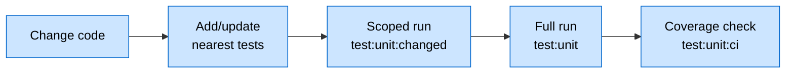

# Frontend Unit Testing — Usage (Agent Edition)

> Running and leveraging the suite. **Vitest** + **@testing-library/react**.

---

## Flow

---

## Commands

| Phase | Command |
|---|---|
| Iterating on a unit | `npm run test:unit:changed` or `vitest run <path>` |
| Before declaring done | `npm run test:unit` (full) |
| CI | `npm run test:unit:ci` with thresholds |

`npm run test:unit:watch` is a human inner-loop tool — agents skip it. Re-run targeted commands on demand.

A scoped pass is a working-loop checkpoint, **not** a completion gate.

---

## Leverage

| Situation | Strategy |
|---|---|
| Rewrite | Test stable business-logic boundaries only — not volatile UI plumbing |
| Bug fix | Failing test first → fix → keep as regression |
| Refactor | Run existing tests → refactor → re-run |

**Prefer testing:** pure utils, hook/store state transitions, error/fallback paths.
**Avoid:** presentation JSX, thin API wrappers without transforms.
